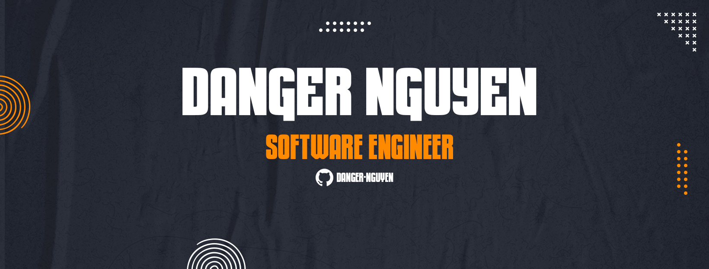

# <p align="center">👋 Hi, I'm Danger Nguyen </p>

<p align="center">Thanks for stopping by, let's see what I have here !! 👇👇 </p>

<p align="center">
  
</p>

<p align="center">👨‍💻 A passionate web and mobile user interface software engineer from Vietnam. Hope my archive can help you somehow!</p>

```typescript
const Danger_Nguyen: typeof SoftwareEngineer = {
    fullName: 'Nguyen Tien Dung',
    university: 'Dai Nam University',
    graduate: '07/2023',
    pronouns: 'he/him',
    hobbies: ["badminton", "programming", "music"],
    programmingLanguages: ['C#', 'Javascript', 'Typescript'],
    from: 'Viet Nam'
}
```

- 📧 How to reach me: dung266200@gmail.com

## ✨ Frameworks & Libraries:
  * <b>Frameworks:</b>
<p align="center">
  <a href="https://nextjs.org/" target="_blank"></a>
  <a href="https://angular.io/" target="_blank"></a>
  <a href="https://learn.microsoft.com/dotnet/welcome" target="_blank"></a>
<!--   <a href="https://react.dev/" target="_blank"></a> -->
  <a href="https://reactnative.dev/" target="_blank"></a>
</p>

 * <b>Libraries:</b>
<p align="center">
  <a href="https://react.dev/" target="_blank"></a>
  <a href="https://ant.design/" target="_blank"></a>
  <a href="https://mui.com/" target="_blank"></a>
  <a href="https://tailwindcss.com/" target="_blank"></a>
  <a href="https://getbootstrap.com/" target="_blank"></a>
</p>

## ✨ Languages & Tools:
 * <b>Languages:</b>
<p align="center">
  <a href="https://www.javascript.com/" target="_blank"></a>
  <a href="https://www.typescriptlang.org/" target="_blank"></a>
  <a href="https://learn.microsoft.com/en-us/dotnet/csharp/" target="_blank"></a>
  <a href="https://html.com/" target="_blank"></a>
  <a href="https://ant.design/" target="_blank"></a>
  <a href="https://sass-lang.com/" target="_blank"></a>
</p>

 * <b>Tools:</b>
<p align="center">
  <a href="https://www.docker.com/" target="_blank"></a>
  <a href="https://www.jenkins.io/" target="_blank"></a>
  <a href="https://git-scm.com/" target="_blank"></a>
  <a href="https://www.sonarsource.com/products/sonarqube/" target="_blank"></a>
  <a href="https://www.adobe.com/vn_vi/products/photoshop.html" target="_blank"></a>
  <a href="https://www.adobe.com/vn_vi/products/aftereffects.html" target="_blank"></a>
  <a href="https://www.adobe.com/vn_vi/products/premiere.html" target="_blank"></a>
</p>

<!--
**danger-nguyen/danger-nguyen** is a ✨ _special_ ✨ repository because its `README.md` (this file) appears on your GitHub profile.

Here are some ideas to get you started:

- 🔭 I’m currently working on ...
- 🌱 I’m currently learning ...
- 👯 I’m looking to collaborate on ...
- 🤔 I’m looking for help with ...
- 💬 Ask me about ...
- 📫 How to reach me: ...
- 😄 Pronouns: ...
- ⚡ Fun fact: ...
-->
